# Academic Co-Pilot

Academic Co-Pilot is a full-stack AI-powered learning platform that transforms a syllabus into a personalized academic workspace. Students can upload a syllabus, generate a study plan, discover resources, attempt quizzes, track performance through a report card, and ask doubts to an AI tutor.

The project now includes:
- **RAG** for syllabus-aware retrieval
- **MCP** for structured AI tools, resources, and prompts
- **Multi-agent orchestration** for tutoring, planning, quiz adaptation, and progress coaching

## Project Highlights

- Syllabus upload via text, PDF, TXT, or Markdown
- Automatic syllabus parsing into subjects, topics, and subtopics
- Personalized study plan generation
- Topic-based resource recommendations
- Quiz generation and quiz submission analysis
- Performance report card with charts, mastery tracking, and feedback
- Groq-powered AI doubt chat
- RAG-backed context retrieval from syllabus knowledge chunks
- MCP server exposing tools, resources, and prompts
- Agentic backend with coordinator, tutor, planner, quiz, and progress agents
- Fallback-safe design so existing features keep working even if agentic flow is unavailable

## Screenshots

### Landing and Authentication

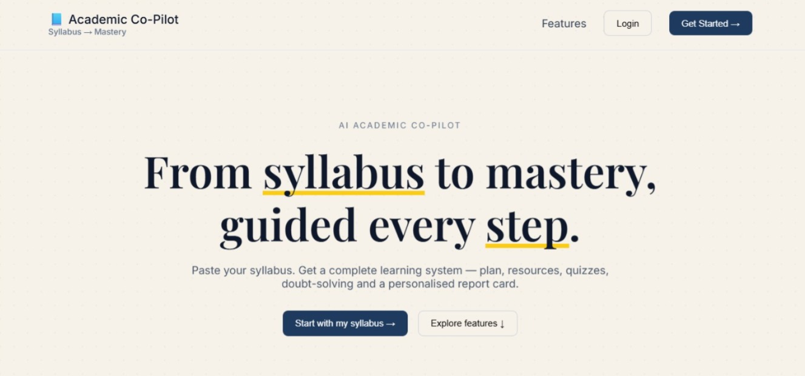
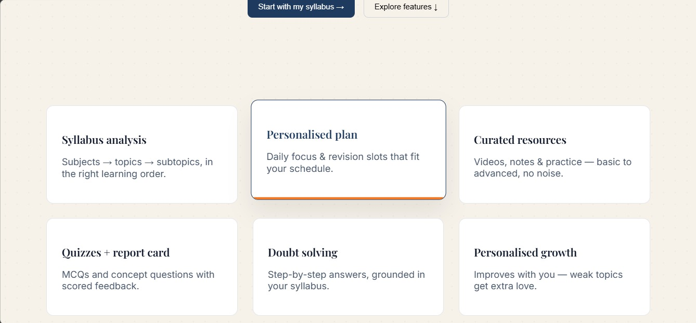
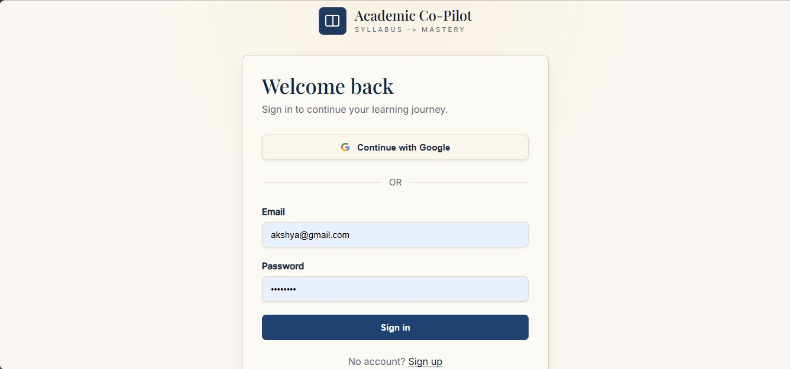
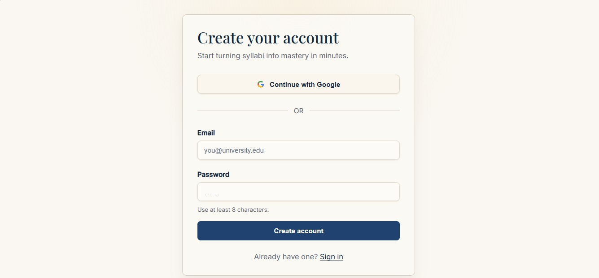

### Dashboard and Syllabus Flow

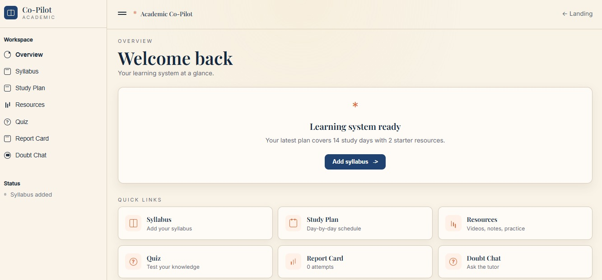
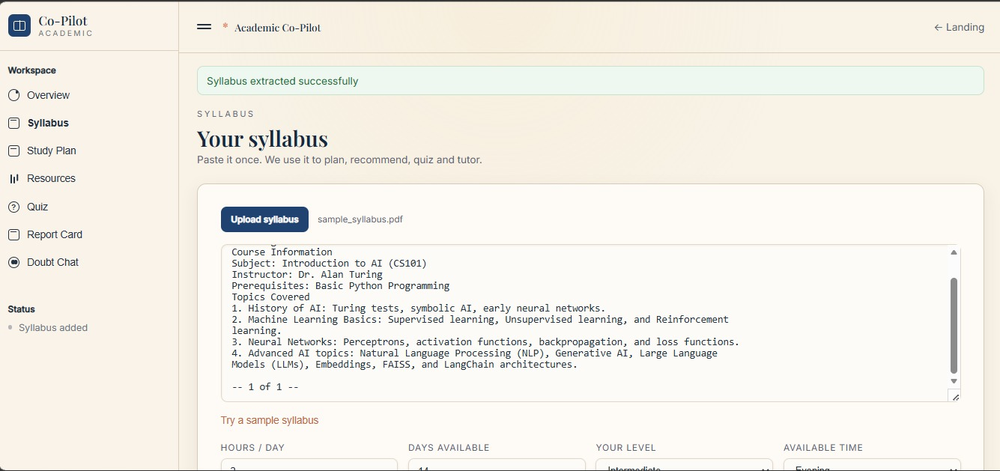
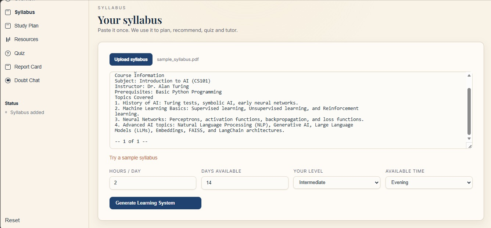

### Study Plan

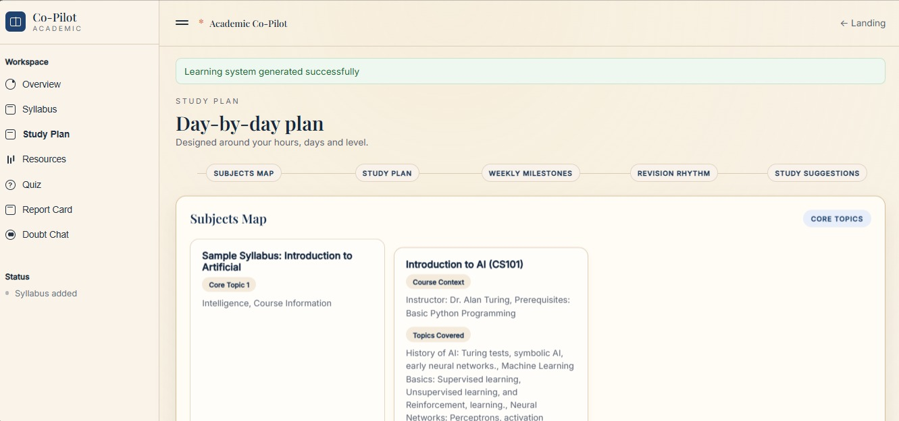
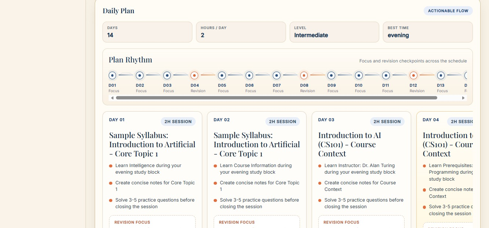
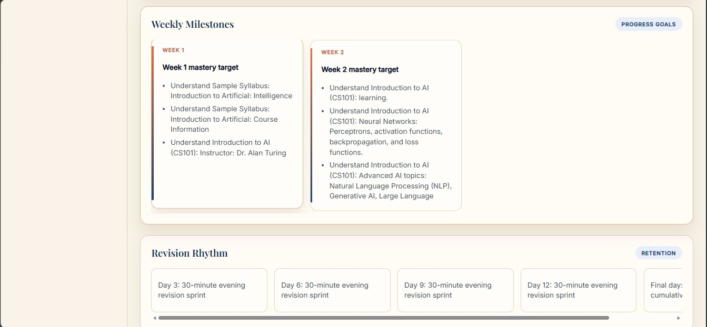
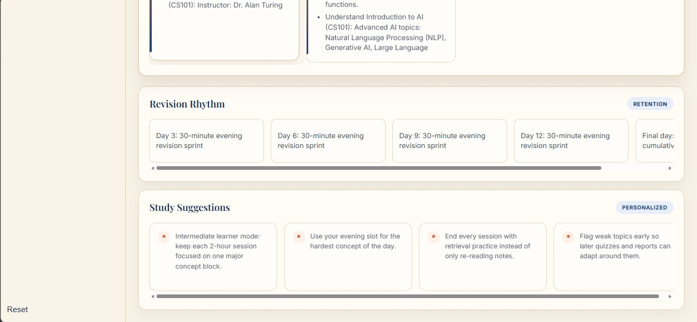

### Resources, Quiz, Report, and Tutor

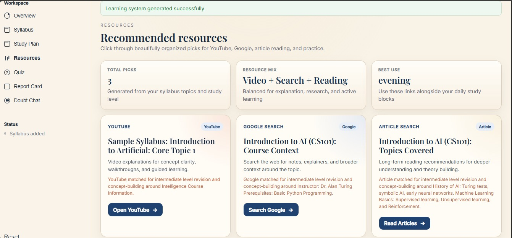
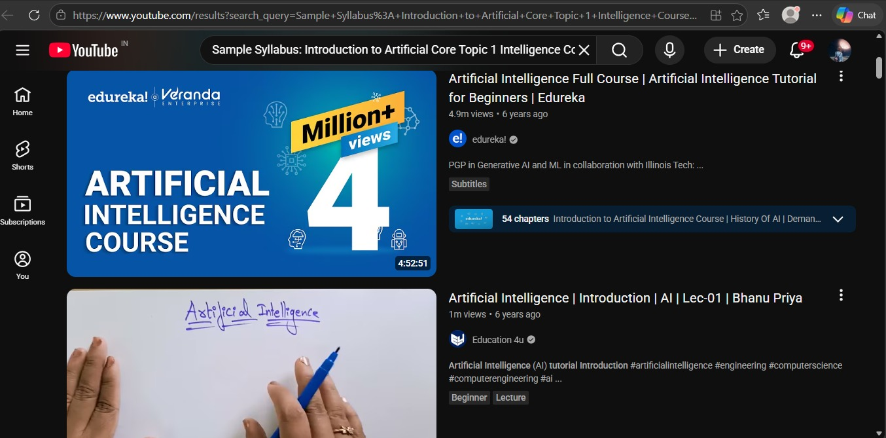
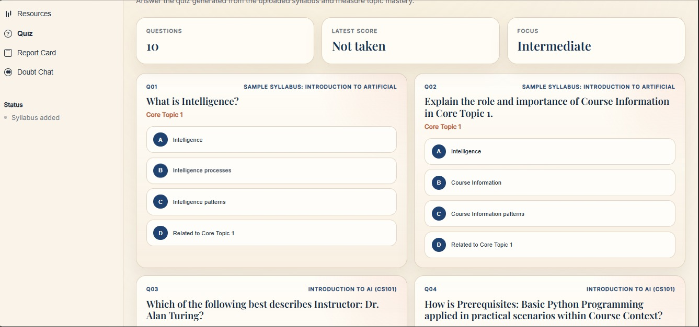
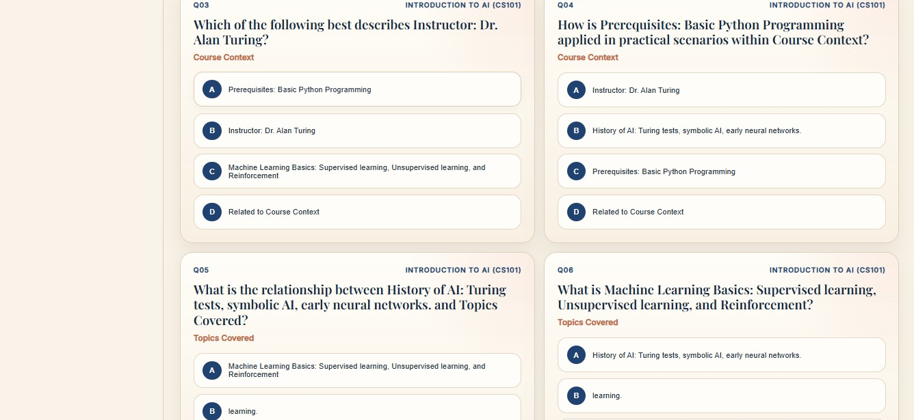
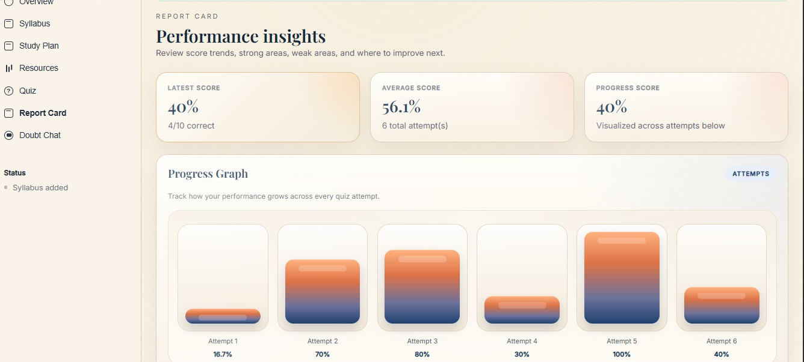
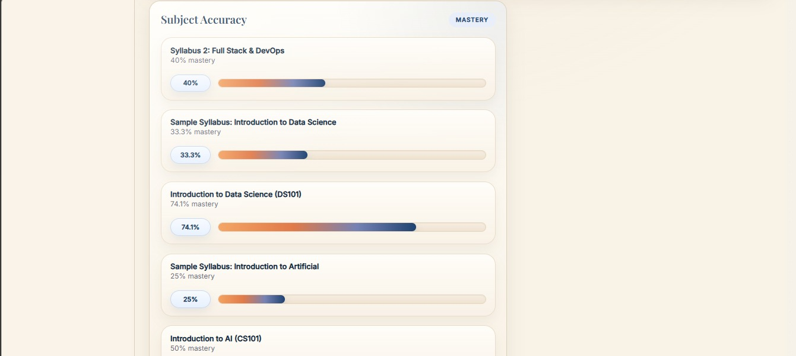
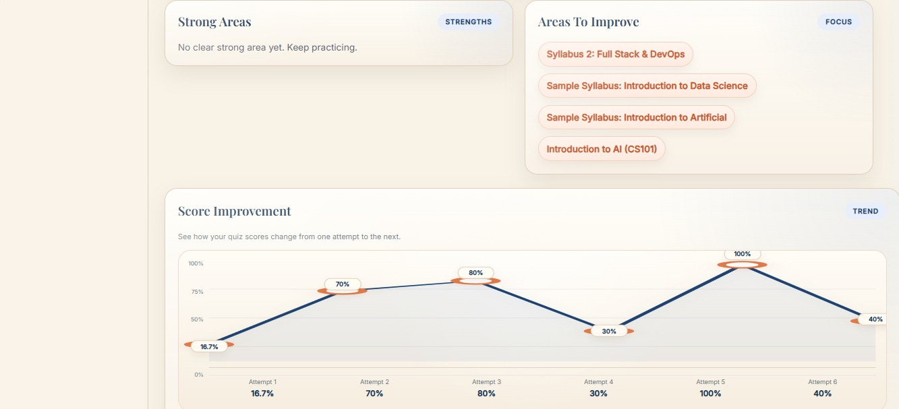
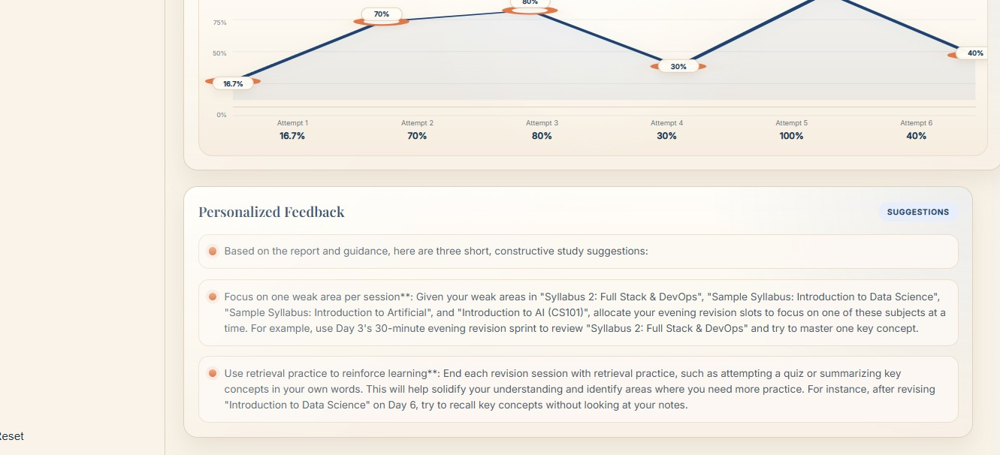
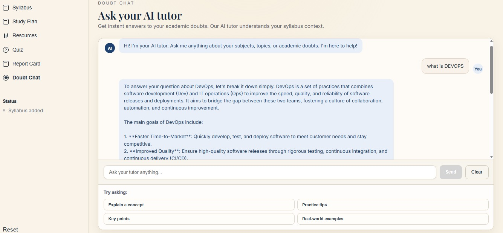

## Problem It Solves

Students often work with raw syllabi that are difficult to convert into a practical study system. Academic Co-Pilot turns unstructured syllabus content into:

- a structured learning plan
- a guided practice workflow
- a performance feedback loop
- an AI-assisted doubt-solving experience

## Core Workflow

1. A student signs up or logs in.
2. The student uploads a syllabus file or pastes syllabus text.
3. The backend extracts and parses the syllabus into structured academic topics.
4. A study plan is generated using the parsed syllabus and user preferences.
5. Topic-based resources are generated.
6. Quiz questions are generated from the same syllabus structure.
7. Quiz attempts are evaluated and stored.
8. The report card shows progress, weak areas, strong areas, trends, and subject mastery.
9. The syllabus is indexed into the RAG layer as retrievable knowledge chunks.
10. When the user asks a doubt, the agent system retrieves relevant syllabus context and produces a context-aware answer using Groq.

## System Architecture

### Architecture Diagram

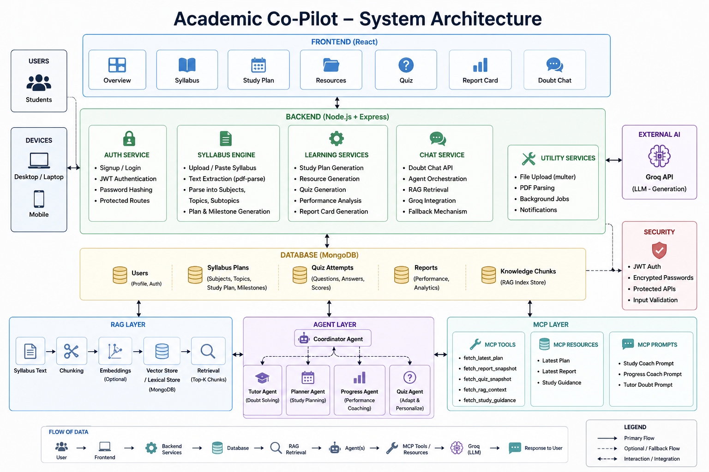

### High-Level Layers

1. **Frontend Layer**
   - React-based dashboard and page routing
   - Handles auth flow and all user interactions

2. **API Layer**
   - Express routes for auth, syllabus, study plan, quiz, report, and doubt chat

3. **Core Learning Engine**
   - syllabus parser
   - study plan generator
   - resource recommendation generator
   - quiz generator
   - performance analyzer

4. **RAG Layer**
   - chunks syllabus knowledge
   - stores knowledge chunks in MongoDB
   - retrieves relevant context for doubt chat
   - supports lexical fallback and optional embeddings-based retrieval

5. **Agent Layer**
   - coordinator agent
   - tutor agent
   - planner agent
   - quiz agent
   - progress agent

6. **MCP Layer**
   - exposes structured tools, resources, and prompts for agent use

7. **LLM Layer**
   - Groq powers final language generation

### Request Flow

```text
User -> React UI -> Express API -> Core Services / RAG / Agents / MCP -> Groq -> Response -> UI
```

## Agentic AI Design

The platform now behaves as an **Agentic AI Learning System**.

### Agents

- **Coordinator Agent**
  - decides whether a request is best handled as tutoring, planning, or progress analysis

- **Tutor Agent**
  - answers student doubts using RAG context and MCP tools

- **Planner Agent**
  - provides study guidance based on the latest plan and student progress

- **Quiz Agent**
  - adapts quiz order using weak-area signals

- **Progress Agent**
  - generates performance coaching and study suggestions from quiz history

### Why Agents Were Added

Agents help the platform move beyond static responses. Instead of treating every request the same way, the system can:

- route the task to the right specialist
- use structured academic context
- personalize support based on the student's learning history

## MCP Integration

The backend includes an MCP server exposed at:

```text
/api/mcp
```

### MCP Tools

- `fetch_latest_plan`
- `fetch_report_snapshot`
- `fetch_quiz_snapshot`
- `fetch_rag_context`
- `fetch_study_guidance`

### MCP Resources

- latest academic plan resource
- latest report resource

### MCP Prompts

- `study-coach`
- `progress-coach`
- `tutor-doubt`

### Why MCP Is Used

MCP gives agents a clean, structured way to access project data and instructions without tightly coupling everything inside a single prompt. This makes the system more modular and easier to extend.

## RAG Integration

Academic Co-Pilot uses a retrieval layer to make AI answers syllabus-aware.

### RAG Workflow

1. When a syllabus is created, the content is chunked.
2. Chunks are stored as knowledge records in MongoDB.
3. On a doubt chat question, the backend retrieves the most relevant chunks.
4. Retrieved context is passed into the Groq prompt.
5. The answer is generated using the retrieved syllabus-aware context.

### Current Retrieval Modes

- **Lexical retrieval fallback**
  - works without extra embedding setup

- **Embeddings-ready retrieval**
  - can be enabled with an OpenAI-compatible embeddings provider

This means the project already supports RAG safely, and can be upgraded further without changing the frontend.

## Tech Stack

### Frontend

- React 18
- React Router
- Axios
- Framer Motion
- Custom CSS

### Backend

- Node.js
- Express
- MongoDB
- Mongoose
- JWT Authentication
- bcryptjs
- multer
- pdf-parse

### AI and Intelligence Layer

- Groq API
- MCP SDK
- Zod
- custom RAG pipeline
- multi-agent orchestration

## Folder Structure

```text
Academic-copilot/
├── assets/
├── backend/
│   ├── config/
│   ├── middleware/
│   ├── models/
│   ├── routes/
│   ├── services/
│   │   ├── agents/
│   │   ├── llm/
│   │   ├── mcp/
│   │   └── rag/
│   ├── .env.example
│   ├── package.json
│   └── server.js
├── frontend/
│   ├── src/
│   └── package.json
└── README.md
```

## Important Backend Modules

### Core Models

- `User`
- `SyllabusPlan`
- `QuizAttempt`
- `KnowledgeChunk`

### Core Services

- `syllabusParser`
- `studyPlanGenerator`
- `ragPipeline`
- `quizGenerator`
- `performanceAnalyzer`
- `fileTextExtractor`
- `doubtChat`

### New Intelligence Services

- `services/rag/*`
- `services/mcp/*`
- `services/agents/*`
- `services/llm/groqClient.js`


## Setup Instructions

### 1. Clone the Repository

```bash
git clone <your-repo-url>
cd Academic-copilot
```

### 2. Install Frontend Dependencies

```bash
cd frontend
npm install
```

### 3. Install Backend Dependencies

```bash
cd ../backend
npm install
```

### 4. Configure Environment Variables

Create a `.env` file inside `backend/` using `backend/.env.example` as reference.

Example:

```env
GROQ_API_KEY=your_groq_api_key_here
GROQ_MODEL=llama-3.3-70b-versatile
AGENTIC_MODE_ENABLED=true
MCP_ENABLED=true
MCP_SERVER_NAME=academic-copilot-mcp
MONGODB_URI=mongodb://127.0.0.1:27017/academic_copilot
RAG_EMBEDDING_BASE_URL=
RAG_EMBEDDING_API_KEY=
RAG_EMBEDDING_MODEL=
```

### 5. Start MongoDB

Make sure MongoDB is running locally, or update `MONGODB_URI` to your hosted database.

### 6. Start the Backend

```bash
cd backend
npm start
```

The backend runs on:

```text
http://localhost:5000
```

### 7. Start the Frontend

```bash
cd frontend
npm start
```

The frontend runs on:

```text
http://localhost:3000
```

## Environment Variable Notes

- `GROQ_API_KEY`
  - required for AI tutor and agent generation

- `GROQ_MODEL`
  - controls the Groq model used for responses

- `AGENTIC_MODE_ENABLED`
  - enables agentic routing and smart backend behavior

- `MCP_ENABLED`
  - enables the MCP endpoint and tool layer

- `MCP_SERVER_NAME`
  - sets the MCP server name

- `MONGODB_URI`
  - MongoDB connection string

- `RAG_EMBEDDING_BASE_URL`
- `RAG_EMBEDDING_API_KEY`
- `RAG_EMBEDDING_MODEL`
  - optional embedding configuration for stronger vector-style retrieval

## API Overview

### Auth

- `POST /api/signup`
- `POST /api/login`

### Dashboard

- `GET /api/dashboard/overview`
- `GET /api/dashboard/plan`
- `GET /api/dashboard/quiz`
- `POST /api/dashboard/quiz/submit`
- `GET /api/dashboard/report`
- `POST /api/dashboard/syllabus`
- `POST /api/dashboard/syllabus/upload`
- `POST /api/dashboard/doubt-chat`

### MCP

- `POST /api/mcp`
- `GET /api/mcp`
- `DELETE /api/mcp`

## How Doubt Chat Works

1. User sends a question from the dashboard.
2. Backend receives it through `/api/dashboard/doubt-chat`.
3. Coordinator agent classifies the request.
4. Relevant MCP tools are called.
5. RAG retrieves useful syllabus chunks.
6. Groq generates a syllabus-aware answer.
7. If anything fails, the backend falls back to the original tutor flow.

## How Quiz and Report Work

### Quiz

- generated from syllabus structure
- can be reordered by the quiz agent based on weak topics
- evaluation stores score, percentage, weak areas, strong areas, and subject accuracy

### Report Card

- built from quiz history
- shows progress trend, accuracy, feedback, and insights
- progress agent can enhance study suggestions

## Future Improvement Ideas

- persistent chat history
- vector database integration for stronger semantic retrieval
- teacher/admin roles
- PDF page-level citation references
- adaptive learning paths based on repeated quiz attempts
- richer analytics and downloadable reports

## Conclusion

Academic Co-Pilot is no longer just a syllabus planner. It is now a complete **AI-powered academic workflow system** combining:

- planning
- retrieval
- tutoring
- assessment
- analytics
- agentic orchestration
- MCP-based structured intelligence

It is designed to stay user-friendly on the frontend while becoming more intelligent and modular on the backend.
